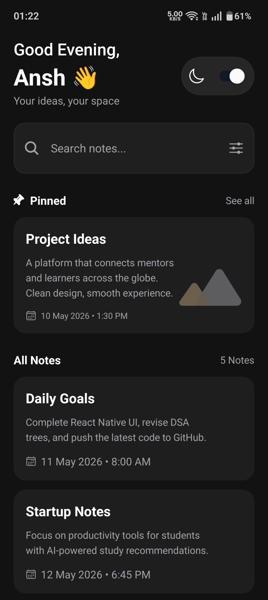
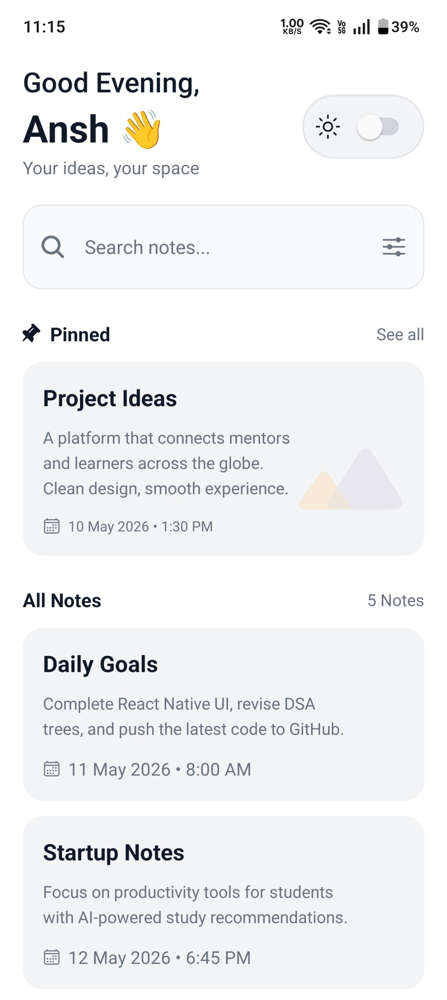
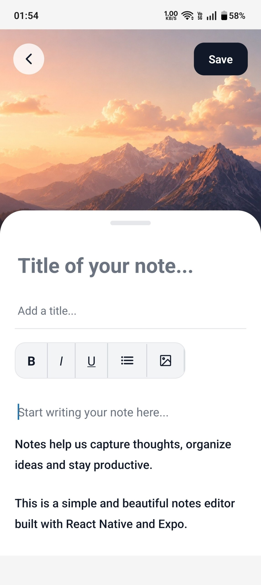

### ScreenShots

---

---

### Features
- Light and Dark themes
- Customizable editor
- Search functionality
- Responsive design
- Editor Theme depending on the system theme

used FlatList, Image, KeyboardAvoidingView, TextInput, useState, StyleSheet, View, Platform, ScrollView, useColorScheme, Switch, Text, useColorScheme, useWindowDimensions, StatusBar, SafeAreaView, ImageBackground, Pressable 